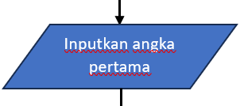
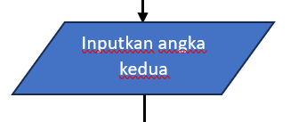

# labpy02

Nama : Muhammad Hafizh Alfauzi

Kelas : TI.24.A.5

NIM : 312410501

Mata Kuliah : Bahasa Pemograman

### flowchart

### Program dalam bentuk python:

### program yang telah diinputkan:

## Membuat program dan flowchart kalkulator sederhana menggunakan if elif else untuk menentukan operasi aritmatika

1.

Titik awal dari flowchart menggunakan simbol oval.

2.

Pengguna diminta menginputkan angka pertama.

3.

Pengguna diminta untuk menginputkan angka kedua.

4.

Pengguna diminta untuk menginputkan operator (+, -, *, /).

5.

Apakah operator = +?

-Jika Ya, maka Hasil = angka pertama + angka kedua. Dan lanjut ke no10.

-Jika Tidak, maka lanjut ke no6.

6.

Apakah operator = -?

-Jika Ya, maka Hasil = angka pertama - angka kedua. Dan lanjut ke no10.

-Jika Tidak, maka lanjut ke no7.

7.

Apakah operator = *?

-Jika Ya, maka Hasil = angka pertama * angka kedua. Dan lanjut ke no10.

-Jika Tidak, maka lanjut ke no8.

8.

Apakah operator = /?

-Jika Ya, maka lanjut ke no9.

-Jika Tidak, maka Hasil = "Error: operator tidak valid!". Dan lanjut ke no10.

9.

Apakah angka kedua ≠ 0?

-Jika Ya, maka Hasil = angka pertama / angka kedua. Dan lanjut ke no10.

-Jika Tidak, maka Hasil = "Error: pembagian dengan nol tidak diperbolehkan". Dan lanjut ke no10

10.

Lalu output atau tampilkan Hasil.

11.

Dan selesai diakhiri menggunakan simbol oval.

### Ini adalah flowchartnya:

### Ini adalah programnya dalam bentuk python:

### Ini adalah hasil dari program yang telah diinputkan:

